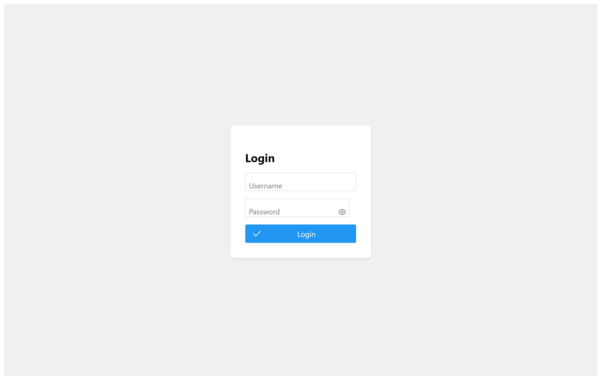

# Atividade de Fixação: Estilização e Interatividade com CSS em React

**Aberto:** terça-feira, 9 jul. 2024, 00:00

**Objetivo:**

Aprender a estilizar componentes React usando arquivos CSS tradicionais e a biblioteca PrimeReact. Eles também irão criar uma tela de login estilizada e adicionar interatividade ao campo de entrada de senha.

**Descrição da Atividade:**

- Crie um arquivo CSS separado e importe-o nos seus componentes React.
- Instale a biblioteca PrimeReact e use-a para estilizar os componentes do seu projeto.
- Crie um componente de tela de login utilizando os componentes estilizados do PrimeReact.
- Adicione estilos personalizados à tela de login usando CSS.
- Adicione interatividade ao campo de entrada de senha, como mostrar/ocultar senha.

Essa atividade te ajudará a entenderem como trabalhar com estilos em um projeto React, utilizando tanto métodos tradicionais quanto bibliotecas modernas como o PrimeReact, além de adicionar interatividade a elementos do formulário.

## Resolução

